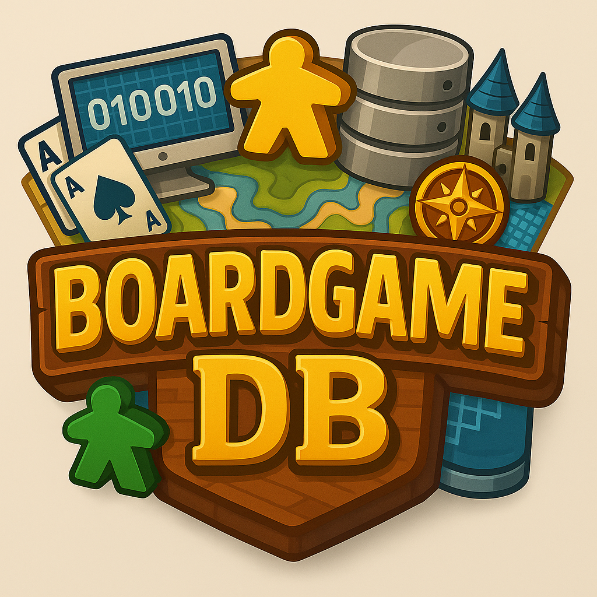

# Overview

This repository contains the source code for my full stack website that shows data for thousands of board games. The files include everything to the initial wireframes to the javascript that made all the features work.


# Features

- Web UI for browsing and interacting with project data
- REST API endpoints for programmatic access
- Static assets (HTML, JS, CSS) are located under webapp/static

# Local Setup Guide

This guide explains how to get the website running locally after downloading the repository.

Prerequisites
- Python 3.10+
- flask (python)
- PostgreSQL (psql command-line) OR Docker (Postgres image)
- Git (optional)

Quick overview
1. Install Python dependencies in a virtual environment.
2. Create a PostgreSQL database and user (or use an existing one).
3. Import the SQL schema and CSV data from the `data/` folder.
4. Update DB settings in `webapp/config.py`.
5. Start the Flask web server and open http://127.0.0.1:5000/

Step-by-step

1) Clone / open repository
- Clone or download the repo

2) Create virtual environment and install packages (PowerShell)
```powershell
cd c:\LOCATION\
python -m venv .venv
.\.venv\Scripts\Activate.ps1
pip install --upgrade pip
pip install -r doc\requirements.txt
```

3) Prepare PostgreSQL and import data
- Make sure PostgreSQL server is running and `psql` is installed and on PATH.
- From the project root run (recommended: run commands from the `data` folder because the SQL uses relative \copy paths):
```powershell
cd data
# If psql is on PATH:
psql -h localhost -U postgres -d postgres -f database-schema.sql
# or use the full psql path if not on PATH (example):
"C:\MY\PATH\TO\psql.exe" -h localhost -U postgres -d postgres -f database-schema.sql
# OR to load the full dump:
psql -h localhost -U postgres -d postgres -f database-dump.sql
```
- Enter the DB user password when prompted. The `database-schema.sql` includes COPY commands that expect the CSVs next to it.

4) Configure the web app
- Edit `webapp/config.py` to match your database settings. Example variables to set:
```python
# webapp/config.py (example)
DATABASE = "postgres"
USER = "postgres"
PASSWORD = "your_db_password"
HOST = "localhost"
PORT = 5432
```

5) Verify DB connectivity (quick Python test)
```powershell
.\.venv\Scripts\Activate.ps1
python - <<'PY'
import psycopg2, webapp.config as cfg
conn = psycopg2.connect(database=cfg.DATABASE, user=cfg.USER,
                        password=cfg.PASSWORD, host=cfg.HOST, port=cfg.PORT)
cur = conn.cursor()
cur.execute("SELECT COUNT(*) FROM game;")
print("rows in game:", cur.fetchone()[0])
conn.close()
PY
```

6) Run the web server
- Either with Flask:
```powershell
setx FLASK_APP "webapp\app.py"
setx FLASK_ENV "development"
# start a new terminal to pick up setx changes, then:
flask run --host=127.0.0.1 --port=5000
```
- Or run the app file directly:
```powershell
.\.venv\Scripts\Activate.ps1
python webapp\app.py
```
- Open: http://127.0.0.1:5000/games

Troubleshooting
- Page shows "No results found.": most likely the DB is empty or `webapp/config.py` has incorrect connection values. Confirm the row count in the `game` (or `games`) table using the Python test above or psql.
- "psql is not recognized": add PostgreSQL's `bin` directory to PATH or call psql with its full path (example in step 3).
- Check the Flask server stdout for printed SQL or errors — the app prints queries and exceptions which help debugging.

Notes
- The repository includes both `database-schema.sql` (with COPYs expecting CSVs in the same folder) and `database-dump.sql` (full dump). Use whichever fits your setup.
- If you prefer Docker, start a postgres container and run the same psql import commands against it (use `docker run` or `docker exec`).


# Credits
 - Authors: Luke Poley, Thomas Lund
 - CS257 Software Design, Spring 2025 taught by Jeff Ondich at Carleton College.
